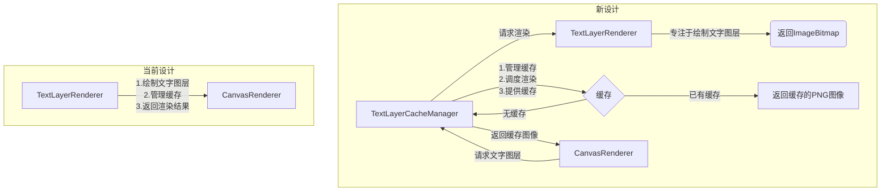

```mermaid
flowchart TD
    subgraph 新设计
    A[TextLayerRenderer] -->|专注于绘制文字图层| B(返回ImageBitmap)
    C[TextLayerCacheManager] -->|1.管理缓存
2.调度渲染
3.提供缓存| D{缓存}
    C -->|请求渲染| A
    D -->|已有缓存| F[返回缓存的PNG图像]
    D -->|无缓存| C
    G[CanvasRenderer] -->|请求文字图层| C
    C -->|返回缓存图像| G
    end

    subgraph 当前设计
    H[TextLayerRenderer] -->|1.绘制文字图层
2.管理缓存
3.返回渲染结果| I[CanvasRenderer]
    end
```
